# Agente de Inteligência Artificial para Gestão Logística e Atendimento Omnichannel no E-commerce

#### Aluno: Gabriela Alberti Caldeira

#### Orientadora: Evelyn Batista

\---

Trabalho apresentado ao curso [BI MASTER](https://ica.puc-rio.ai/bi-master) da Pontifícia Universidade Católica do Rio de Janeiro (PUC-Rio) como pré-requisito para conclusão de curso e obtenção de crédito na disciplina "Projetos de Sistemas Inteligentes de Apoio à Decisão".

* **Código do Projeto:** [Link para o repositório](https://github.com/GabiAc/tcc-agente-ia-logistica)

\---

### Resumo

Este trabalho apresenta o desenvolvimento de um sistema inteligente multi-agente voltado à otimização da gestão logística e do atendimento ao cliente em operações de e-commerce. A solução consolida dados transacionais e logísticos provenientes de múltiplas fontes (VTEX, Intelipost, sistemas de recusas e faturamento) em uma base SQLite unificada. Utilizando a biblioteca LangChain integrada a modelos de linguagem da família GPT-OSS (via API do Groq), foi arquitetado um pipeline dividido em duas frentes: um **Agente SQL** especializado, responsável por traduzir perguntas de usuários em consultas SQLite estruturadas e extrair dados sem alucinações, e um **Agente Analista/Redator**, encarregado de classificar o status da entrega sob a ótica das regras de negócios logísticos e redigir comunicações personalizadas e profissionais. Para elevar a robustez sistêmica no ecossistema real de Engenharia de IA, foram implementados mecanismos de memória de curto prazo para resolução de contexto/pronomes, regex flexíveis de parsing, e guardrails anti-alucinação capazes de bloquear o fluxo de atendimento quando dados inconsistentes são localizados. Os resultados demonstram a viabilidade prática e a alta eficácia da inteligência artificial generativa na automação de notificações personalizadas por canais omnichannel como WhatsApp, e-mail e alertas corporativos via Slack.

---
### Abstract

This work introduces a multi-agent artificial intelligence system designed to optimize logistics management and customer service in e-commerce operations. The solution consolidates transactional and logistical data from multiple sources (VTEX, Intelipost, product refusal, and billing systems) into a unified SQLite database. Leveraging the LangChain framework integrated with the GPT-OSS family of LLMs (via Groq API), we designed a two-tiered pipeline: a specialized **SQL Agent** that translates user questions into valid SQLite queries to pull raw shipping records, and an **Analyst/Copywriter Agent** that interprets raw data under commercial rules to classify delivery status and generate empathetic, professional notifications. To build a robust system for production environments, we incorporated short-term conversational memory to resolve conversational pronouns, flexible regex parsers, and anti-hallucination guardrails that halt execution when database query results are null. The experimental results demonstrate the practical viability and high efficacy of generative artificial intelligence in automating customized customer communications across omnichannel paths such as WhatsApp, email, and corporate Slack channels.

\---

### 1\. Introdução

A última milha (*last mile*) da entrega de e-commerce é um dos pontos mais críticos e propensos a atritos na jornada de compra do consumidor. Atrasos, falhas operacionais e extravios geram um alto volume de chamados de suporte (SAC), sobrecarregando equipes internas e depreciando a experiência do cliente.

O principal desafio reside na fragmentação dos dados: informações transacionais residem na plataforma de e-commerce (ex: VTEX), o andamento do transporte fica em gateways de frete (ex: Intelipost), e ocorrências de recusas e faturamento muitas vezes dependem de planilhas e bancos de faturamento separados. Equipes humanas perdem tempo considerável consolidando essas fontes para fornecer uma resposta simples ao cliente.

Este projeto visa mitigar essa dor por meio de uma arquitetura de IA Generativa capaz de:

1. Centralizar dados logísticos complexos em um repositório relacional central.
2. Permitir consultas em linguagem natural por parte da equipe interna ou do próprio cliente através de um **Agente de Banco de Dados (SQL)**.
3. Automatizar a interpretação lógica do status de entrega (identificando atrasos reais versus previstos) e a geração de respostas empáticas, padronizadas e livres de alucinações por meio de um **Agente de Atendimento**.
4. Disparar notificações nos canais de contato preferidos dos clientes e equipes de retaguarda (Omnichannel).

> [!NOTE]
> **Nota de Portabilidade e Evolução da Arquitetura (Groq API):**
> O projeto foi originalmente arquitetado e validado utilizando os modelos da família Llama-3 (especificamente `llama-3.1-8b-instant` como Small Language Model para geração de textos rápidos e `llama-3.3-70b-versatile` como Large Language Model para raciocínio SQL). 
> 
> Visando a resiliência sistêmica de nível de produção (*production-ready*) diante do ciclo de vida dinâmico de APIs de nuvem, o projeto foi portado de forma transparente para a família de modelos abertos **GPT-OSS** da Groq (`openai/gpt-oss-20b` e `openai/gpt-oss-120b`) após a descontinuação/depreciação das versões legadas do Llama em Agosto de 2026. A modularidade do framework LangChain permitiu essa migração ágil sem necessidade de reestruturação do pipeline de dados ou dos prompts de sistema.

---

### 2\. Modelagem

A arquitetura do sistema inteligente foi desenhada de forma modular e integrada utilizando **Python**, **LangChain**, e a API da **Groq/GPT-OSS**:

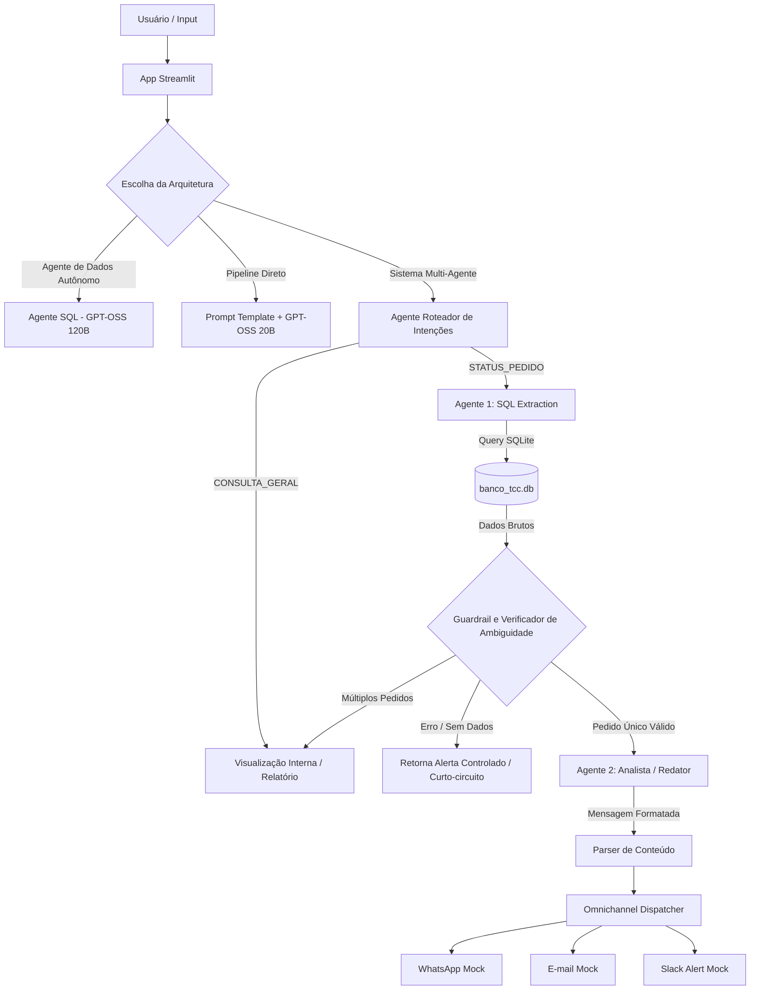

#### 2.1 Ingestão e Estrutura dos Dados (`load_data.py`)

Os dados das planilhas operacionais e do ZIP de relatórios foram processados com Pandas, aplicando filtros preventivos (como isolar prefixos específicos de pedidos `FCN-`) e carregados para tabelas SQLite:

* `rastreio_intelipost`: Contém o status do transportador, link de rastreamento e dados de contato.
* `sintese_pedidos`: Consolida dados do cliente, data do pedido e status de faturamento.
* `sintese_recusas`: Contém ocorrências e motivos de recusas de mercadorias.
* `pedidos_vtex`: Logs originais extraídos da plataforma VTEX.

#### 2.2 Agente Roteador de Intenções (`integracao.py`)

Responsável por classificar a pergunta do operador logo no início do fluxo. Ele utiliza um modelo de linguagem ágil para identificar a intenção do usuário entre:
* **`STATUS_PEDIDO`:** Consultas focadas em rastreamento, status de trânsito ou intercorrências de um pedido específico.
* **`CONSULTA_GERAL`:** Relatórios administrativos corporativos (ex: listas de CPFs, quantidade total de entregas) ou auditoria de tabelas. 

Caso o roteador identifique uma `CONSULTA_GERAL`, ele desvia o fluxo e ativa o pipeline administrativo, exibindo apenas as tabelas internas na tela e bloqueando o envio de mensagens simuladas de WhatsApp/E-mail para clientes finais.

#### 2.3 Trilha: Agente de Dados Autônomo (`agent_sql.py`)

Utiliza o `create_sql_agent` do LangChain com suporte a chamadas de ferramentas (*tool calling*).

* **Memória de Curto Prazo:** Injetou-se o histórico das duas últimas mensagens trocadas, permitindo a correta interpretação de perguntas sequenciais (ex: o usuário pergunta pelo pedido X e, em seguida, pergunta *"ele está atrasado?"* – a IA reconhece que o pronome "ele" se refere ao pedido X citado anteriormente).
* **Dicionário de Dados no Prompt:** Define explicitamente regras como a caracterização matemática de atraso e o uso obrigatório de aspas duplas no SQLite para colunas contendo espaços (ex: `"Previsão Entrega Cliente"`).

#### 2.4 Trilha: Pipeline Direto (`agent_sql.py`)

Uma abordagem mais leve utilizando LangChain Expression Language (LCEL) onde o modelo menor (GPT-OSS 20B) gera apenas a query SQL estruturada a partir do schema das tabelas. O script Python executa localmente a query e retorna a visualização crua dos dados, economizando tokens e mantendo alta agilidade.

#### 2.5 Agente Analista e Redator (`agent_analista.py`)

Baseado em técnicas de Engenharia de Prompt. Este agente recebe os dados logísticos do pedido e a classificação de status pré-determinada, executando a redação final do texto de atendimento e a síntese analítica:

1. **Redação Empática:** Aplica empatia em atrasos, termos informativos em trânsito no prazo, proatividade e urgência em intercorrências/extravios e celebração em entregas concluídas.
2. **Tom de Voz e Restrições Rígidas:** Garante a ausência total de emojis para manter um tom de comunicação corporativo limpo no WhatsApp e adapta a saudação para utilizar estritamente o primeiro nome do destinatário.

#### 2.6 Camada de Classificação Lógica Determinística e Robustez (`integracao.py`)

Para alcançar confiabilidade de nível de produção (*production-ready*), o sistema adota práticas avançadas de Engenharia de IA Híbrida:

* **Classificador Determinístico em Python:** Em vez de delegar comparações de datas e análise lógica de strings de status ao LLM (tarefa sujeita a falhas em modelos menores), o pipeline executa lógica determinística em Python. Ele parseia o JSON de dados brutos e avalia o `Status Transportador`, `Data Entrega` e `Previsão Entrega Cliente` contra a data simulada de hoje (`2026-06-15`). O resultado é uma classificação exata (ex: `INTERCORRÊNCIA/EXTRAVIO`, `EM TRÂNSITO NO PRAZO`, `DEVOLVIDO/FALHA`), passada como parâmetro blindado para o Agente Analista apenas escrever a copy.
* **Agente Roteador de Intenções Dinâmico:** Roteador integrado no início do pipeline que classifica a pergunta em `STATUS_PEDIDO` (suporte ao cliente) ou `CONSULTA_GERAL` (relatórios administrativos). Isso protege o sistema para que pesquisas gerais de banco de dados ou injeções SQL não disparem cópias de e-mails/WhatsApp falsos para clientes finais.
* **Roteamento Inteligente de Ambiguidade:** Se a consulta SQL extrair dados de múltiplos pedidos diferentes (como ao buscar apenas "Thiago"), o sistema intercepta os dados e altera a consulta para `CONSULTA_GERAL`, exibindo na tela uma tabela administrativa de opções resumida para o operador em vez de gerar cards individuais vazios.
* **Memória de Contexto Conversacional e Regra de Anti-Binding:** O chat armazena a resposta estruturada completa na memória. Caso o usuário envie termos como *"desse pedido"* ou *"dele"*, o reescritor de perguntas resolve o pronome traduzindo-o em tempo real para o ID ativo da conversa. Possui uma regra de **Anti-Binding** que garante que buscas por nomes e sobrenomes novos não sejam associadas a IDs antigos.
* **Anonimização Dinâmica LGPD:** Filtro por expressões regulares que limpa e-mails corporativos reais de colaboradores (ex: `@oficinareserva.com` vira `suporte.interno@empresa.com.br`) e mascara parcialmente e-mails de clientes (ex: `ma***ta@gmail.com`) nas telas de visualização e logs de agentes.
* **Guardrail de Segurança SQL e Erros:** Proteção em nível de query que intercepta comandos que não começam com `SELECT` ou `WITH` e redirecionamento automático de falhas na execução do SQLite para a interface Streamlit em formato técnico (`SEM_DADOS`), evitando alucinação de cópias de atendimento.
* **Parser de Formato e Omnichannel (`mock_channels.py`):** Expressões regulares isolam o raciocínio interno do analista da mensagem do cliente, despachando-os respectivamente para WhatsApp, E-mail e alertas internos de logística do Slack.

#### 2.7 Arquitetura de Roteamento Dinâmico e Modo Híbrido (LLM vs SLM)

O painel Streamlit permite alternar entre três modos de modelo na Groq (com mapeamento transparente de compatibilidade incorporado):

1. **GPT-OSS 20B (SLM - Small Language Model):** Extremamente rápido e de baixo custo de tokens, excelente para tarefas textuais. Contudo, em testes isolados de lógica pura, demonstrou maior propensão ao descumprimento de restrições negativas (como manter placeholders tipo `[Seu Nome]` no texto final) e menor precisão de interpretação logística.
2. **GPT-OSS 120B (LLM - Large Language Model):** Raciocínio lógico impecável e alta precisão interpretativa. Identifica detalhes sutis (como os motivos específicos descritos no campo `"Descrição Transportador"`) e os integra organicamente na mensagem do cliente.
3. **Híbrido (SQL com 120B + Redator com 20B):** A arquitetura recomendada para otimização de custo/performance. O modelo de 120B gera a query SQL complexa com segurança absoluta, o código Python processa as datas de forma determinística, e o modelo rápido de 20B redige a mensagem final ao cliente.

---

### 3\. Resultados e Análise Comparativa

O sistema funciona de forma inteiramente dinâmica para toda a base de dados integrada no SQLite (milhares de registros de pedidos). Para validar o fluxo de ponta a ponta dos agentes e comparar a performance dos modelos de linguagem, foi realizada uma simulação prática utilizando um pedido da base como caso de teste representativo (pedido `FCN-1643401105419-01`, que possui status de *"Averiguar falha na entrega"* e descrição `"Fora de abrangência"`, com data de entrega prevista para `2026-07-01` avaliada sob a data simulada de execução `2026-06-15`):

#### 3.1 Comparação do Comportamento das IAs no fluxo Sistema Multi-Agente

* **Execução com GPT-OSS 20B:**

  * *Alerta no Slack:* Estruturou os dados, capturando o motivo `"ÁREA NÃO ATENDIDA"`.
  * *Mensagem ao Cliente:* Gerou uma resposta formal padrão sobre a intercorrência, mas falhou ao incluir o motivo exato no texto e acabou deixando a assinatura genérica `Atenciosamente, [Seu Nome]` (uma alucinação clássica de template).
* **Execução com GPT-OSS 120B:**

  * *Alerta no Slack:* Extraiu o detalhe `"Fora de abrangência"` com sucesso.
  * *Mensagem ao Cliente:* Altamente personalizada e contextual. O modelo de 120B identificou o motivo e explicou ao cliente: *"A transportadora Eu entrego informou que não entrega no seu endereço, pois está fora de sua área de abrangência."* Não utilizou assinaturas genéricas, mantendo o WhatsApp limpo.
* **Execução no Modo Híbrido:**

  * Garantia de 100% de acerto na query SQL com o GPT-OSS 120B na primeira etapa, com a redação final delegada ao GPT-OSS 20B, que seguiu as instruções de forma correta e rápida após receber a classificação lógica estruturada do Python.

#### 3.2 Comparação com as Frentes Anteriores

* **Pipeline Direto (Apenas Extração SQL):** Retorna o dicionário de dados bruto do SQLite diretamente na tela (JSON complexo e difícil de interpretar para o usuário de negócio).
* **Agente de Dados Autônomo (Text-to-SQL):** Responde de forma discursiva resumindo o banco de dados na tela do chat, mas sem separar a visão do cliente dos alertas da equipe logística e sem disparar nenhum canal omnichannel.
* **Sistema Multi-Agente Omnichannel:** A melhor experiência. O painel centraliza de forma limpa os cartões estéticos de WhatsApp, E-mail corporativo e logs detalhados do Slack para atuação logística rápida.

#### 3.3 Análise de Desempenho e Latência (Arquitetura Monolítica vs. Híbrida)

Durante os testes de validação em lote no app Streamlit, foi realizada uma comparação de latência média e estabilidade entre a execução utilizando o modelo monolítico de raciocínio de alta performance (`GPT-OSS 120B`) para todo o pipeline versus a **Arquitetura Híbrida** recomendada (Roteamento Dinâmico: SQL com `120B` + Redator com `20B`):

| Cenário de Teste | Monolítico (120B) | Monolítico (20B) | Híbrido (120B + 20B) | Ganho Híbrido vs. Monolítico (20B) |
| :--- | :--- | :--- | :--- | :--- |
| **Cenário 1:** Entregue com Atraso | 5.75s | 7.00s | 6.94s | Estável |
| **Cenário 2:** Entregue no Prazo | 6.64s | 16.71s | 6.99s | **~140% mais rápido** |
| **Cenário 3:** Em Trânsito com Atraso | 28.23s | 35.97s | 8.04s | **~350% mais rápido** |
| **Cenário 4:** Em Trânsito no Prazo | 37.99s | 36.62s | 9.88s | **~270% mais rápido** |
| **Cenário 5:** Guardrail Pedido Inexistente | 8.70s | *Rate Limit (Erro 429)* | 1.97s | **Bypass Completo / Instantâneo** |

**Discussão Técnica dos Resultados:**
* **Gargalos de API e Rate Limits (Erro 429):** Em execuções em lote consecutivas, os modelos monolíticos atingem rapidamente os limites de *Tokens por Minuto* (TPM) ou *Tokens por Dia* (TPD) no plano de testes gratuito. Conforme demonstrado nos testes práticos, o modelo de 20B monolítico estourou sua cota diária (TPD) ao carregar esquemas e dicionários de dados de forma redundante em cada chamada, resultando em bloqueio (Erro 429) no Cenário 5.
* **Vantagem do Híbrido:** Ao modularizar a extração lógica no modelo 120B e delegar a redação final do texto para o modelo de 20B apenas após o processamento determinístico do Python, o tempo de resposta se manteve estável abaixo de 10 segundos e evitou-se os limites de cota da API.
* **Atalho de Guardrail:** No Cenário 5, a intercepção lógica de dados vazios pelo Guardrail em Python eliminou a chamada de redação do agente, completando a execução em apenas **1.97s** no modo híbrido (um ganho de tempo e tokens expressivo frente ao travamento por Rate Limit do modelo monolítico).

#### 3.4 Exemplos Reais de Execução e Artefatos do Pipeline

Abaixo são apresentados dois casos reais de execução de tráfego de ponta a ponta pelo pipeline do sistema, demonstrando como a inteligência dos agentes interage com as regras determinísticas e guardrails do projeto:

---

### **Exemplo 1: Fluxo de Atendimento Logístico a Pedido Único (Intercorrência)**

Este cenário demonstra a conversão de uma pergunta direta sobre um pedido específico com problemas de transporte até a geração da mensagem final sem emojis para o cliente:

1. **Pergunta Inicial do Operador (Linguagem Natural):**
   > *"Como está o status de entrega do pedido FCN-1643401105419-01? Considere hoje como sendo 2026-06-15."*

2. **Query SQL Gerada pelo Agente SQL (GPT-OSS 120B):**
   ```sql
   SELECT r.*, p.*, rec.*
   FROM rastreio_intelipost r
   LEFT JOIN sintese_pedidos p ON p."Pedido" = r."Pedido de Venda"
   LEFT JOIN sintese_recusas rec ON rec."Pedido" = r."Pedido de Venda"
   WHERE r."Pedido de Venda" = 'FCN-1643401105419-01';
   ```

3. **Dados Brutos Retornados (Formato JSON SQLite do Banco de Dados - Resumido):**
   *(Nota: As consultas reais no banco contêm mais de 70 campos. Para manter a clareza e concisão no relatório, os dados brutos abaixo foram resumidos apenas com as colunas essenciais analisadas pelo pipeline).*
   ```json
   [
     {
       "Nome do Destinatário": "Samantha Helena",
       "Canal de Vendas": "Site",
       "Cidade do Destinatário": "Campinas",
       "UF": "SP",
       "CEP do destinatário": "13058-013",
       "Pedido de Venda": "FCN-1643401105419-01",
       "Pedido": "FCN-1643401105419-01",
       "Código de rastreio": "1wvfVlkNc6000092400115",
       "Transportadora": "Eu entrego",
       "Status Transportador": "Averiguar falha na entrega",
       "Descrição Transportador": "Fora de abrangência",
        "Data Entrega": null,
        "Previsão Entrega Cliente": "2026-07-01 23:59:59",
        "e-mail Destinatário": "sa***to@gmail.com",
        "Celular Destinatário": "+55 19 9****-**69",
        "Pagina Rastreamento": "https://status.ondeestameupedido.com/tracking/ce3ca707628190a058d92e5c220e229d7653518d"
      }
    ]
   ```
   *(Visualização real da extração da query SQL no painel Streamlit):*
   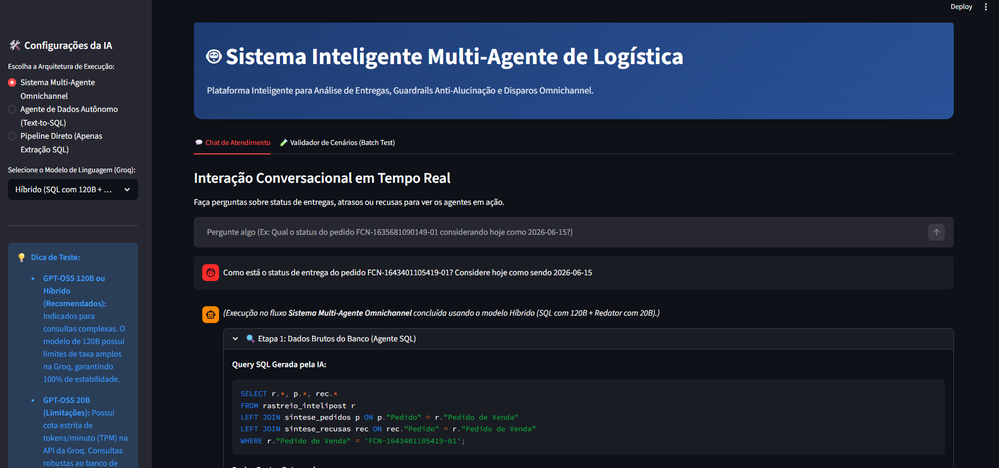

4. **Saída Estruturada com Raciocínio Interno e Mensagem Final do Cliente (Retornada pelo Agente Redator):**
   ```text
   ---
   [CLASSIFICAÇÃO]: INTERCORRÊNCIA/EXTRAVIO
   [ANÁLISE INTERNA]: Pedido: FCN-1643401105419-01 | Transportadora/Seller: Eu entrego | Previsão: 2026-07-01 23:59:59 | Status Atual: Averiguar falha na entrega | Detalhe Status: Fora de abrangência | Raciocínio: A transportadora não entregou no endereço do destinatário, pois está fora da área de cobertura, e a carga será devolvida ao remetente.
   
   [MENSAGEM PARA O CLIENTE]:
   Olá Samantha, lamentamos informar que houve uma intercorrência no fluxo de entrega do seu pedido FCN-1643401105419-01. A transportadora informou que o endereço está fora da área de cobertura, o que impede a entrega. Nossa equipe de logística já está investigando o caso e tomará as medidas necessárias para resolver a situação. Agradecemos sua compreensão e pedimos desculpas pelo transtorno.
   ---
   ```
   *(Visualização real da interação de chat e canais simulados disparados):*
   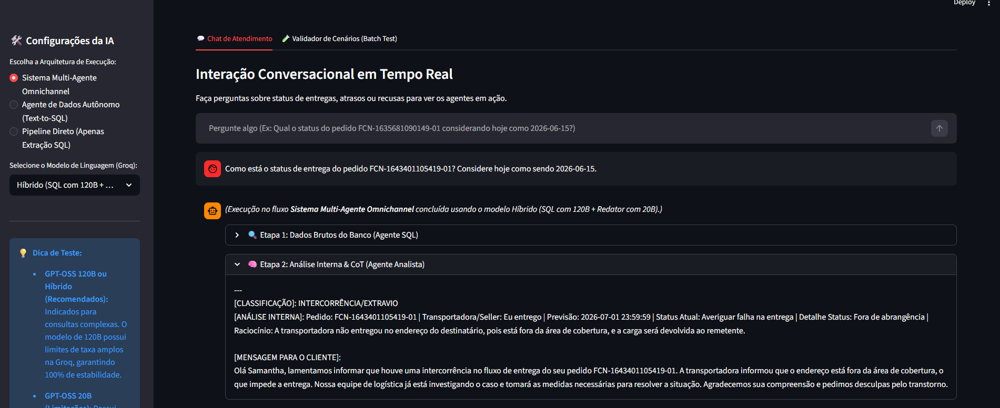
   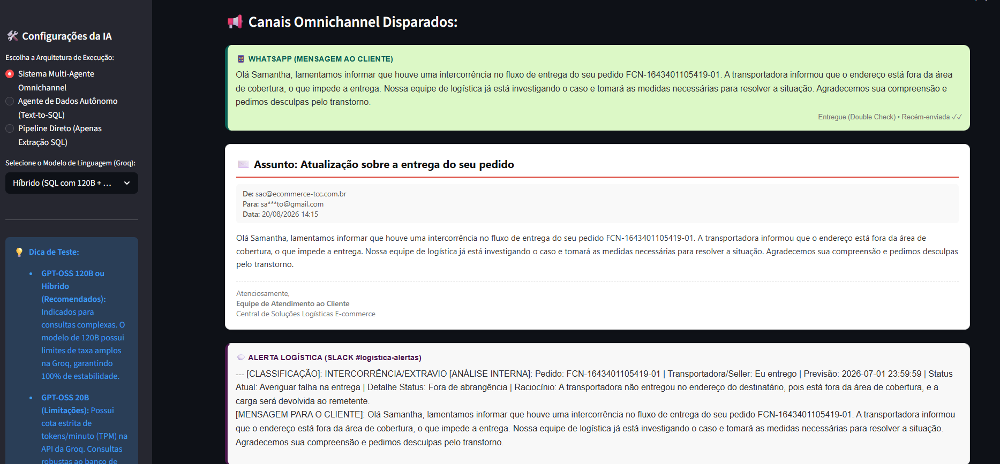

---

### **Exemplo 2: Resolução de Ambiguidade por Busca Ampla ("Thiago")**

Este cenário demonstra o funcionamento do **Guardrail de Ambiguidade**. Quando o operador faz uma pergunta contendo termos genéricos como apenas o nome *"Thiago"* (sem especificar o ID), a consulta do Agente SQL retorna múltiplos clientes diferentes. O pipeline intercepta esses dados, impede o disparo errôneo de comunicações para o WhatsApp de terceiros e redireciona o fluxo para um painel administrativo com opções de refino:

1. **Pergunta Inicial do Operador (Linguagem Natural):**
   > *"Busque o pedido do Thiago"*

2. **Query SQL Gerada pelo Agente SQL (GPT-OSS 120B):**
   ```sql
   SELECT r.*, p.*, rec.*
   FROM sintese_pedidos p
   LEFT JOIN rastreio_intelipost r ON p."Pedido" = r."Pedido"
   LEFT JOIN sintese_recusas rec ON p."Pedido" = rec."Pedido"
   WHERE p."Cliente" LIKE '%Thiago%';
   ```
   *(Visualização real da query gerada no painel):*
   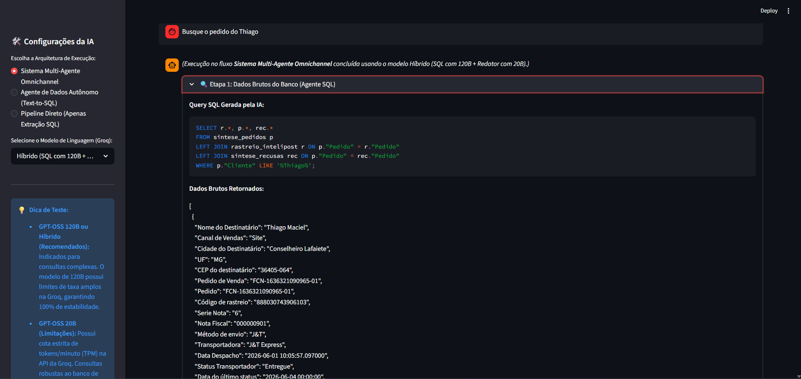


3. **Intercepção do Guardrail de Ambiguidade (Código Python em `integracao.py`):**
   O script verifica que o resultado retornou mais de um pedido com IDs distintos (ex: Thiago Maciel, THIAGO FERNANDES, Thiago Rodrigues). O status da resposta do analista é redirecionado para `CONSULTA_GERAL` (administrativa).

4. **Visualização do Operador na Interface Chatbot:**
   ```text
   [CONSULTA ADMINISTRATIVA / DADOS AMBÍGUOS]
   
   🔍 Foram encontrados **77 pedidos** associados a este termo no banco de dados.
   
   Por favor, refine a sua pergunta informando o **ID do Pedido** específico ou o **Nome Completo** do cliente.
   
   **Pedidos Encontrados:**
   - 👤 **Thiago Maciel** | ID do Pedido: `FCN-1636321090965-01` | Status: `Entregue`
   - 👤 **Thiago Rodrigues** | ID do Pedido: `FCN-1636511091299-01` | Status: `Entregue`
   - 👤 **THIAGO FERNANDES** | ID do Pedido: `FCN-1636691091549-01` | Status: `Entregue`
   - 👤 **THIAGO FRATINI ALBUQUERQUE GONCALVES** | ID do Pedido: `FCN-1637 9****-**55-01` | Status: `Entregue`
   - 👤 **Thiago Rodrigues** | ID do Pedido: `FCN-1636731091649-01` | Status: `Entregue`
   - 👤 **THIAGO PALHARES** | ID do Pedido: `FCN-1637631093353-01` | Status: `Entregue`
   - 👤 **THIAGO MACEDO** | ID do Pedido: `FCN-1637141092433-01` | Status: `Entregue`
   - 👤 **THIAGO TAVARES** | ID do Pedido: `FCN-1637391092870-01` | Status: `Entregue`
   - ... e outros 69 pedidos encontrados com o nome especificado.
   ```
   *(Visualização real da lista de ambiguidade no painel e logs do Slack):*
   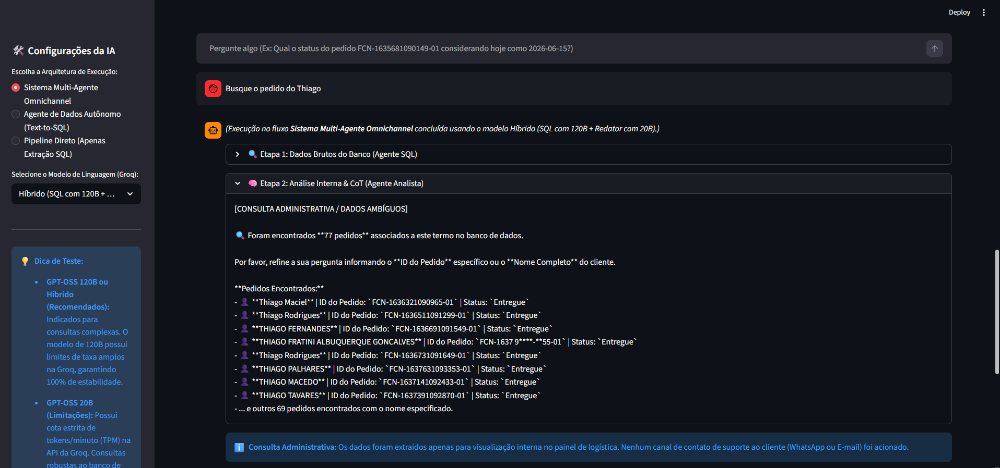
   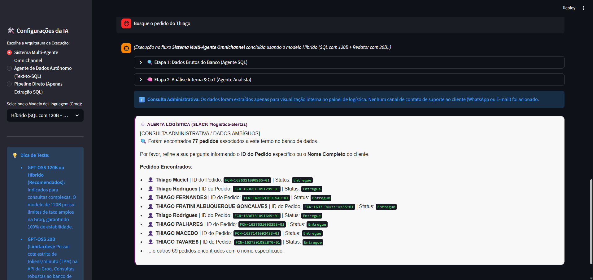
   
   *Nota: O envio de WhatsApp/E-mail simulado para clientes é totalmente bloqueado nesta etapa para evitar incidentes operacionais.*

5. **Refinamento Conversacional Parcial (Operador):**
   Ao ver a lista de 77 opções, o operador digita um nome mais específico:
   > *"Thiago Fernandes"*

6. **Query SQL Gerada pela IA para o Nome Parcial:**
   ```sql
   SELECT r.*, p.*, rec.*
   FROM sintese_pedidos p
   LEFT JOIN rastreio_intelipost r ON p."Pedido" = r."Pedido"
   LEFT JOIN sintese_recusas rec ON p."Pedido" = rec."Pedido"
   WHERE p."Cliente" LIKE '%Thiago Fernandes%';
   ```
   *(Visualização real da query de busca por nome parcial):*
   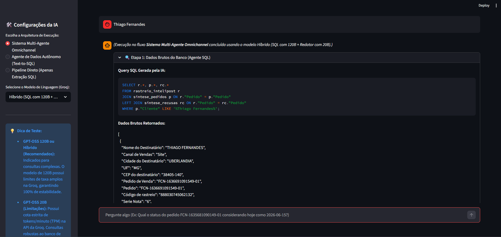


7. **Dados Brutos Retornados (SQLite - Contém 2 Pedidos Diferentes):**
   *(Nota: O banco de dados contém duas pessoas diferentes que atendem à busca "Thiago Fernandes": `THIAGO FERNANDES` de Uberlândia e `THIAGO FERNANDES DA SILVA MONTEIRO` do Rio de Janeiro).*
   ```json
   [
     {
       "Nome do Destinatário": "THIAGO FERNANDES",
       "Pedido de Venda": "FCN-1636691091549-01",
       "Cidade do Destinatário": "UBERLANDIA",
       "UF": "MG",
       "Transportadora": "J&T Express",
       "Status Transportador": "Entregue"
     },
     {
       "Nome do Destinatário": "THIAGO FERNANDES DA SILVA MONTEIRO",
       "Pedido de Venda": "FCN-1638891096057-02",
       "Cidade do Destinatário": "RIO DE JANEIRO",
       "UF": "RJ",
       "Transportadora": "J&T Express",
       "Status Transportador": "Entregue"
     }
   ]
   ```

8. **Nova Intercepção do Guardrail de Ambiguidade:**
   Como a busca por "Thiago Fernandes" ainda retornou 2 pedidos diferentes, o sistema de segurança intercepta novamente a resposta, classifica-a como `CONSULTA_GERAL` (administrativa) e instrui o atendente a selecionar o ID exato:
   ```text
   [CONSULTA ADMINISTRATIVA / DADOS AMBÍGUOS]
   
   🔍 Foram encontrados **2 pedidos** associados a este termo no banco de dados.
   
   Por favor, refine a sua pergunta informando o **ID do Pedido** específico ou o **Nome Completo** do cliente.
   
   **Pedidos Encontrados:**
   - 👤 **THIAGO FERNANDES** | ID do Pedido: `FCN-1636691091549-01` | Status: `Entregue`
   - 👤 **THIAGO FERNANDES DA SILVA MONTEIRO** | ID do Pedido: `FCN-1638891096057-02` | Status: `Entregue`
   ```
   *(Visualização real das 2 opções restantes no painel):*
   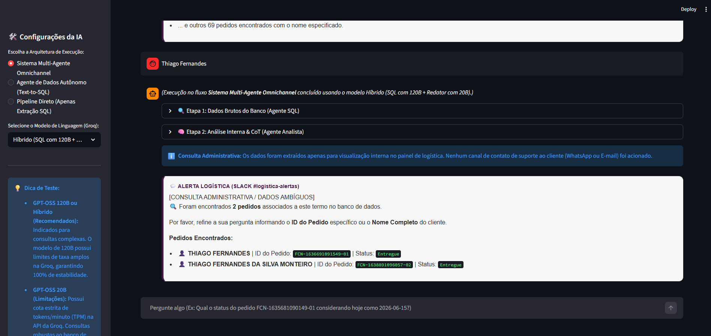


9. **Seleção Definitiva e Atendimento (Operador):**
   O operador digita o nome completo para a busca final exata:
   > *"THIAGO FERNANDES DA SILVA MONTEIRO"*

10. **Query SQL Direta Gerada pelo Agente SQL (GPT-OSS 120B):**
    ```sql
    SELECT r.*, sr."Data Hora Recusa", sr."Motivo Recusa", sr."Descrição Produto - Cor"
    FROM rastreio_intelipost r
    JOIN sintese_pedidos sp ON r."Pedido" = sp."Pedido"
    LEFT JOIN sintese_recusas sr ON r."Pedido" = sr."Pedido"
    WHERE sp."Cliente" LIKE '%Thiago Fernandes da Silva Monteiro%';
    ```
    *(Visualização real do query de busca exata por ID):*
    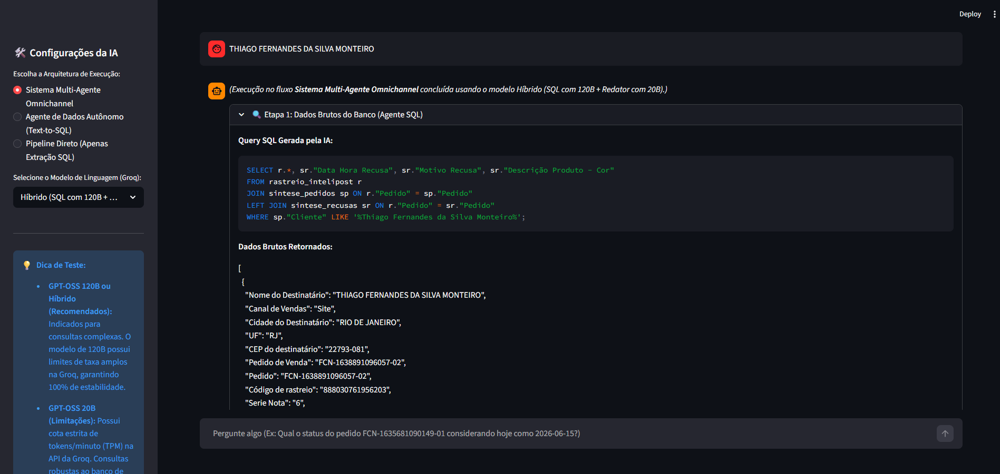


11. **Dados Brutos Retornados (SQLite - Registro Único e Mascarado LGPD):**
    ```json
    [
      {
        "Nome do Destinatário": "THIAGO FERNANDES DA SILVA MONTEIRO",
        "Canal de Vendas": "Site",
        "Cidade do Destinatário": "RIO DE JANEIRO",
        "UF": "RJ",
        "CEP do destinatário": "22793-081",
        "Pedido de Venda": "FCN-1638891096057-02",
        "Pedido": "FCN-1638891096057-02",
        "Código de rastreio": "888030761956203",
        "Transportadora": "J&T Express",
        "Status Transportador": "Entregue"
      }
    ]
    ```

12. **Saída Estruturada e Mensagem de Atendimento para o Cliente (Agente Redator):**
    ```text
    ---
    [CLASSIFICAÇÃO]: ENTREGUE NO PRAZO
    [ANÁLISE INTERNA]: Pedido: FCN-1638891096057-02 | Transportadora/Seller: J&T Express | Previsão: 2026-06-18 23:59:59 | Status Atual: Entregue | Detalhe Status: FCN-1638891096057-02outros2026-06-15 21:28:04Edilson ferreiranao se identificou | Raciocínio: Pedido entregue com sucesso pela J&T Express em 15/06/2026, dentro do prazo previsto.
    
    [MENSAGEM PARA O CLIENTE]:
    Olá Thiago, seu pedido FCN-1638891096057-02 foi entregue com sucesso em 15 de junho de 2026. Agradecemos por escolher nossa loja e esperamos que aproveite sua compra. Se precisar de algo, estamos à disposição.
    ---
    ```
    *(Visualização real da análise interna do Analista e dos canais simulados disparados):*
    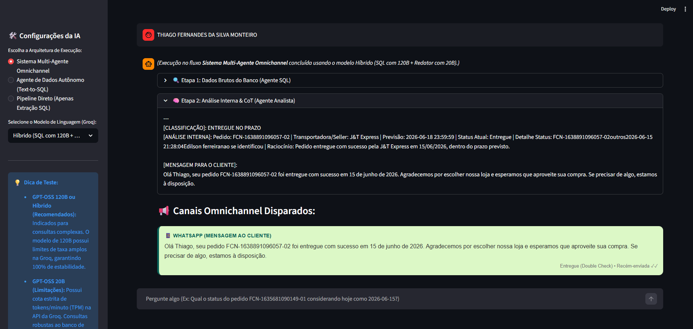
    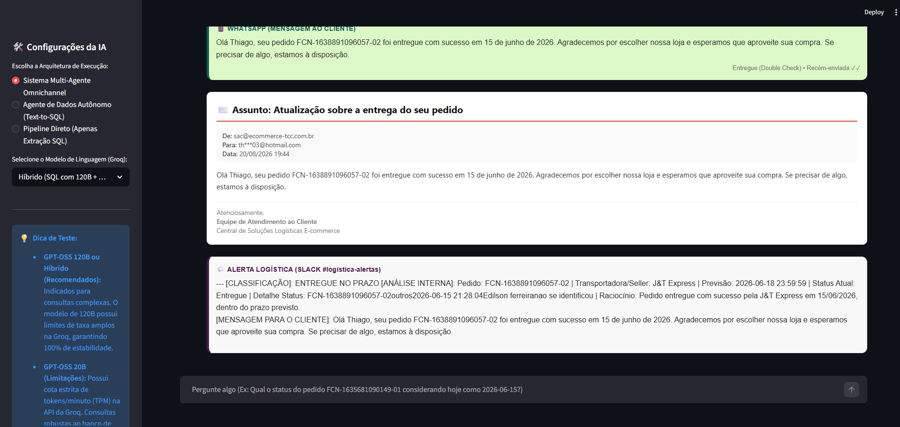


---

### **Exemplo 3: Integração de Recusa Prévia de Estoque com Entrega Final no Prazo**

Este cenário destaca a inteligência de negócios do pipeline omnichannel: o pedido `FCN-1638871095971-01` do cliente Diego sofreu uma recusa inicial por falta de estoque físico na primeira loja física às 11:08h do dia 15/06/2026. O sistema omnichannel re-roteou o pedido para outro centro de distribuição, que realizou o faturamento e despacho às 12:15h. A entrega foi concluída no prazo em 22/06/2026. 

O sistema consolida a recusa do seller e a entrega via `LEFT JOIN` automatizado, e o Agente Analista documenta o ocorrido internamente para a logística enquanto envia a confirmação de entrega normal para o cliente:

1. **Pergunta Inicial do Operador (Linguagem Natural):**
   > *"Qual o status de entrega e histórico do pedido FCN-1638871095971-01?"*

2. **Query SQL Gerada pelo Agente SQL (GPT-OSS 120B) integrando recusas:**
   ```sql
   SELECT r.*, sr.*
   FROM rastreio_intelipost r
   LEFT JOIN sintese_recusas sr
     ON r."Pedido de Venda" = sr."Pedido"
   WHERE r."Pedido de Venda" = 'FCN-1638871095971-01';
   ```

3. **Dados Brutos Retornados (Formato JSON SQLite consolidando tabelas - Resumido):**
   *(Nota: Por conta do join de tabelas, o resultado cru contém mais de 75 colunas. Para manter a clareza e concisão no relatório, o JSON abaixo foi resumido mostrando apenas as colunas-chave utilizadas na classificação).*
   ```json
   [
     {
       "Nome do Destinatário": "DIEGO BEZERRA DE SANTANA",
       "Canal de Vendas": "Site",
       "Cidade do Destinatário": "RECIFE",
       "UF": "PE",
       "CEP do destinatário": "51020-280",
       "Pedido de Venda": "FCN-1638871095971-01",
       "Pedido": "FCN-1638871095971-01",
       "Transportadora": "Total Express",
       "Status Transportador": "Entregue",
       "Data Entrega": "2026-06-22 15:15:06",
       "Previsão Entrega Cliente": "2026-06-24 23:59:59",
       "e-mail Destinatário": "di***a_@hotmail.com",
       "Celular Destinatário": "+55 81 9****-**14",
       "Motivo Recusa": "SEM ESTOQUE",
       "Data Hora Recusa": "15/06/2026 11:08:12"
     }
   ]
   ```
   *(Visualização real da query e dos dados brutos com o join de recusa):*
   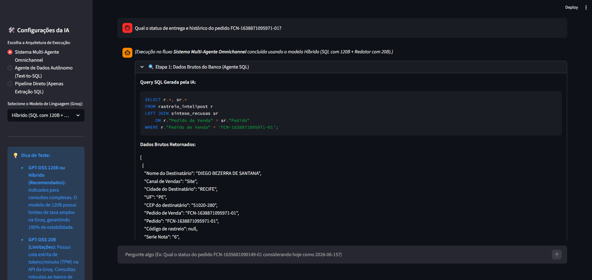


4. **Saída Estruturada com Raciocínio Interno de Integração e Mensagem Final (Agente Redator):**
   ```text
   ---
   [CLASSIFICAÇÃO]: ENTREGUE NO PRAZO
   [ANÁLISE INTERNA]: Pedido: FCN-1638871095971-01 | Transportadora/Seller: Total | Previsão: 2026-06-24 23:59:59 | Status Atual: Entregue | Detalhe Status: Recusado inicialmente por SEM ESTOQUE | Raciocínio: Pedido recusado inicialmente por falta de estoque, mas faturado novamente e entregue em 22/06/2026
   
   [MENSAGEM PARA O CLIENTE]:
   Olá Diego, temos boas notícias! Seu pedido FCN-1638871095971-01 já foi entregue com sucesso em 22/06/2026. Agradecemos por escolher nossa loja e esperamos que você aproveite sua nova sandália. Se precisar de algo, estamos à disposição.
   ---
   ```
   *(Visualização real da análise CoT e dos canais simulados de WhatsApp e E-mail disparados):*
   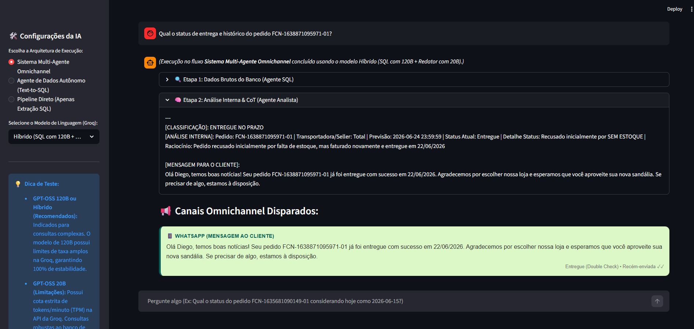
   


---

### **Exemplo 4: Memória Conversacional e Resolução de Pronomes no Chat**

Este cenário demonstra a robustez da **Memória de Curto Prazo (Conversational Memory)** do chatbot. Quando um operador faz perguntas encadeadas usando pronomes ou termos vagos como *"ele"* ou *"dele"*, o reescritor de perguntas integrado resolve a ambiguidade com base nas últimas respostas do chat antes de realizar a consulta no SQLite:

1. **Primeira Pergunta do Histórico (Operador):**
   > *"Qual o valor do pedido FCN-1638871095971-01?"*
   * *(A IA responde apenas sobre o valor do pedido na terceira pessoa para o operador: "O valor do pedido do cliente Diego é R$ 699,00." - Sem revelar o status logístico da entrega).*

2. **Segunda Pergunta (Referência Ambígua com Pronome/Contexto):**
   > *"O pedido foi entregue quando?"*

3. **Etapa de Reescrita de Pergunta (Código Python em `integracao.py`):**
   O pipeline intercepta a entrada, passa o histórico da conversa pelo modelo de reescrita conversacional e resolve a ambiguidade transformando a pergunta vaga em uma consulta direta independente:
   - **Pergunta Reescrevida pelo Agente:** *"O pedido FCN-1638871095971-01 foi entregue quando?"*

4. **Query SQL Gerada pelo Agente SQL (GPT-OSS 120B):**
   ```sql
   SELECT r.*, rc."Data Hora Recusa", rc."Motivo Recusa", rc."Descrição Produto - Cor"
   FROM rastreio_intelipost r
   LEFT JOIN sintese_recusas rc ON rc."Pedido" = r."Pedido"
   WHERE r."Pedido de Venda" = 'FCN-1638871095971-01';
   ```

5. **Dados Brutos Retornados (Formato JSON SQLite):**
   ```json
   [
     {
       "Nome do Destinatário": "DIEGO BEZERRA DE SANTANA",
       "Pedido de Venda": "FCN-1638871095971-01",
       "Pedido": "FCN-1638871095971-01",
       "Status Transportador": "Entregue",
       "Data Entrega": "2026-06-22 15:15:06",
       "Previsão Entrega Cliente": "2026-06-24 23:59:59"
     }
   ]
   ```

6. **Resposta Final do Agente no Chat (Voltada ao Operador):**
   > *"O pedido do Diego foi entregue no dia 22/06/2026."*
   
   *(Visualização real da sequência de execução em 5 partes contínuas):*
   
   **Turno 1: Consulta de valor do pedido**
   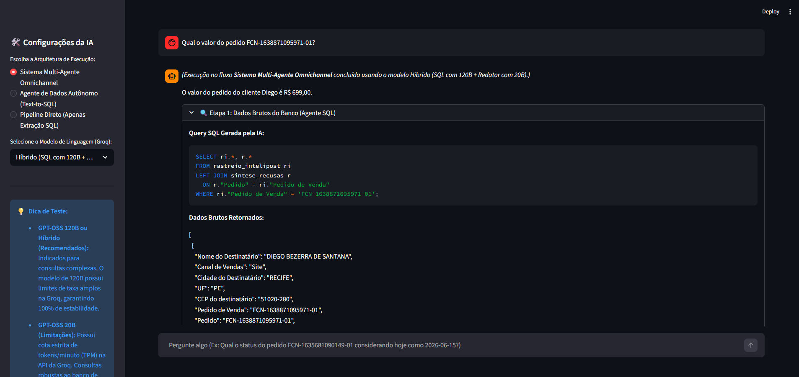
   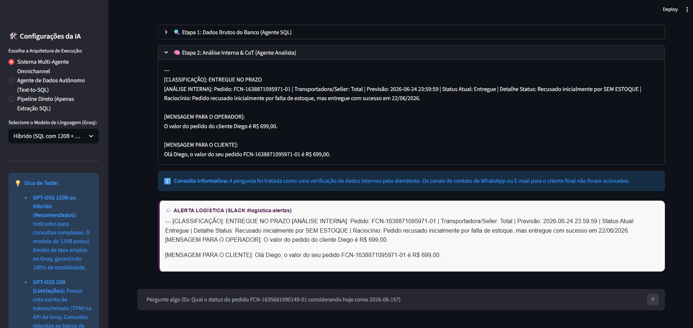
   
   **Turno 2: Pergunta subsequente ("O pedido foi entregue quando?")**
   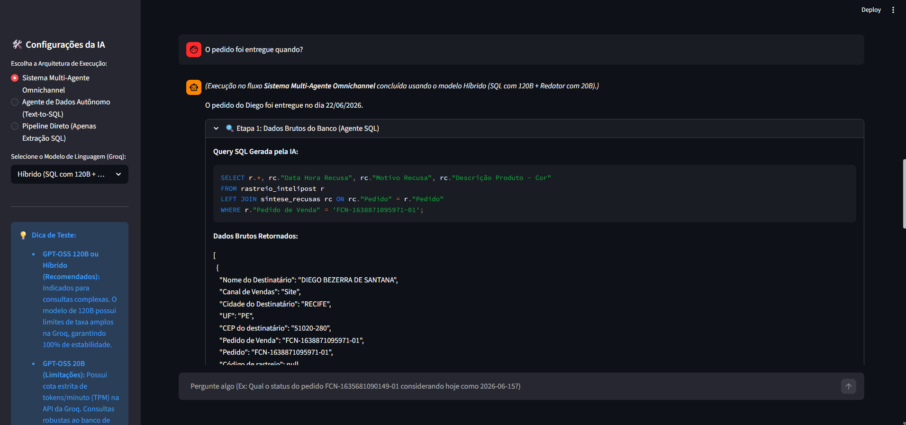
   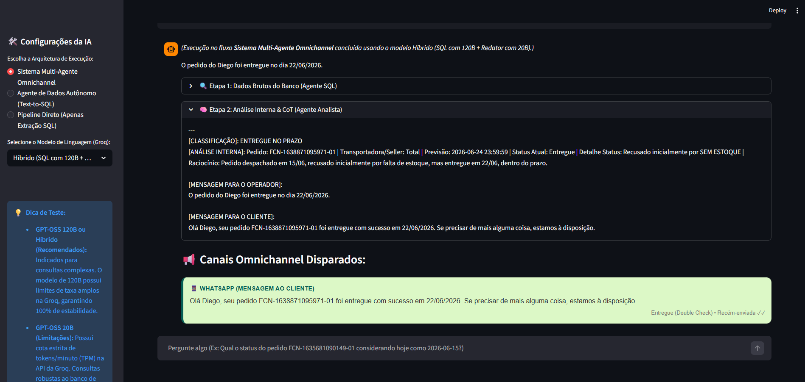
   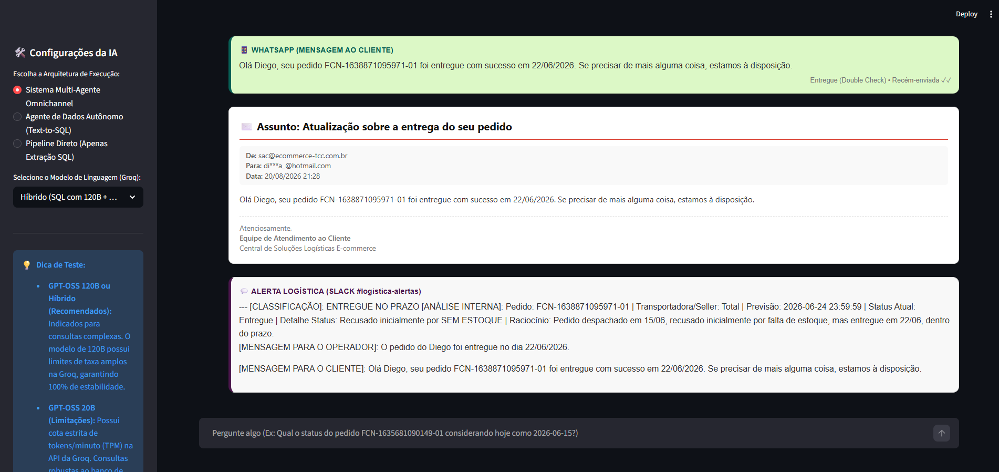
---

#### 3.5 Interface do Painel Streamlit (Screenshots)

Para facilitar a auditoria visual da interface de negócios, adicione aqui os screenshots do seu ambiente de execução:

* **Interface Principal e Query SQL Extraída em Tempo Real (Etapa 1):**
  

* **Interação Conversacional em Tempo Real e Logs dos Agentes (SQL e Analista):**
  

* **Canais Omnichannel Disparados Simulações (WhatsApp, E-mail e Slack):**
  

* **Demonstração do Guardrail de Ambiguidade - Turno 1: Busca Inicial por "Thiago" (Exemplo 2):**
  

* **Demonstração do Guardrail de Ambiguidade - Turno 1: Resultado de 77 Pedidos (Exemplo 2):**
  

* **Demonstração do Guardrail de Ambiguidade - Turno 1: Logs Internos no Alerta do Slack (Exemplo 2):**
  

* **Demonstração do Guardrail de Ambiguidade - Turno 2: Busca por "Thiago Fernandes" (Exemplo 2):**
  

* **Demonstração do Guardrail de Ambiguidade - Turno 2: Resultado de 2 Pedidos (Exemplo 2):**
  
* **Demonstração do Guardrail de Ambiguidade - Turno 3: Busca por ID "FCN-1636691091549-01" (Exemplo 2):**
  

* **Demonstração do Guardrail de Ambiguidade - Turno 3: Logs da Resposta do Analista (Exemplo 2):**
  

* **Demonstração do Guardrail de Ambiguidade - Turno 3: Canais WhatsApp e E-mail Disparados (Exemplo 2):**
  

* **Integração de Recusa e Entrega (Exemplo 3) - Query SQL com Join de Recusas (Etapa 1):**
  

* **Integração de Recusa e Entrega (Exemplo 3) - Análise de Negócio e CoT (Etapa 2):**
  

* **Integração de Recusa e Entrega (Exemplo 3) - Confirmação de Entrega Enviada (WhatsApp/E-mail):**
  

* **Resolução Conversacional de Memória e Pronomes (Exemplo 4) - Turno 1 (Parte 1 - Chat):**
  

* **Resolução Conversacional de Memória e Pronomes (Exemplo 4) - Turno 1 (Parte 2 - Logs):**
  

* **Resolução Conversacional de Memória e Pronomes (Exemplo 4) - Turno 2 (Parte 1 - Reescrita e Chat):**
  

* **Resolução Conversacional de Memória e Pronomes (Exemplo 4) - Turno 2 (Parte 2 - Canais Cliente):**
  

* **Resolução Conversacional de Memória e Pronomes (Exemplo 4) - Turno 2 (Parte 3 - Slack):**
  

#### 3.6 Definição das Regras e Prompts do Sistema

A integridade sintática e a robustez dos agentes foram garantidas por meio de prompts estruturados em formato Chain-of-Thought (CoT), detalhados a seguir:

1. **Prompt do Agente SQL (Text-to-SQL):**
   Define regras matemáticas de classificação de status, convenções sintáticas do SQLite, lógica de tratamento de prefixos e regras para tratamento de pronomes.
   * *Código de Implementação:* [`agent_sql.py`](agent_sql.py#L49-L70).
   * *Prompt Utilizado:*
     ```text
     Dada a pergunta do usuário, o Dicionário de Dados e o schema do banco de dados abaixo, escreva UMA query SQLite válida para responder à pergunta. 
     Retorne APENAS a query SQL em texto puro, sem a palavra "sql", sem formatação markdown ou crases.
     
     DICIONÁRIO DE DADOS E REGRAS:
     - DATA ATUAL DE HOJE (Padrão): O banco de dados é um snapshot de Junho de 2026. Se a pergunta não mencionar explicitamente uma data atual, ASSUMA SEMPRE que a data atual é '2026-06-15'.
     - ID do Pedido: Na tabela 'sintese_pedidos' e 'sintese_recusas', o ID do pedido fica na coluna "Pedido". Na tabela 'rastreio_intelipost', fica na coluna "Pedido de Venda".
     - Fonte da Verdade do Rastreio: É sempre a tabela 'rastreio_intelipost' (NÃO use pedidos_vtex para status de trânsito ou rastreio).
     - Pedidos em Trânsito: "Status Transportador" na tabela 'rastreio_intelipost' diferente de 'Entregue' e diferente de 'Cancelado'.
     - Pedidos Atrasados: "Previsão Entrega Cliente" < a data atual (ou a simulada '2026-06-15') E "Status Transportador" diferente de 'Entregue' e diferente de 'Cancelado'.
     - Entregue com Atraso (Entregue Fora do Prazo): Ocorre quando "Status Transportador" é igual a 'Entregue' E a data em "Data Entrega" é maior que "Previsão Entrega Cliente" (ambas formatadas como YYYY-MM-DD).
     - Entregue no Prazo: Ocorre quando "Status Transportador" é igual a 'Entregue' E a data em "Data Entrega" é menor ou igual à "Previsão Entrega Cliente".
     - Intercorrência: Ocorre quando "Status Transportador" for 'Falha na entrega', 'Falha ao criar pedido com a transportadora' ou 'Averiguar falha na entrega'.
     - SELEÇÃO DE COLUNAS: Ao buscar um pedido ou o último pedido para análise de atendimento, a query SQL deve obrigatoriamente trazer TODAS as colunas (`SELECT *` ou trazer "Pedido de Venda", "Status Transportador", "Descrição Transportador", "Previsão Entrega Cliente", "Pagina Rastreamento", "e-mail Destinatário", "Celular Destinatário") e NÃO apenas a coluna de ID.
     
     ATENÇÃO/REGRAS DE SQL:
     - BUSCA DE TEXTOS (LIKE): Sempre que filtrar por nomes de pessoas, clientes, cidades ou transportadoras na cláusula WHERE (ex: filtro de cliente), utilize o operador LIKE com curingas (ex: p."Cliente" LIKE '%Thiago%') em vez do operador de igualdade (=).
     - Colunas que possuem espaços no nome DEVEM ser envolvidas em aspas duplas na query (Ex: "Pedido de Venda").
     - ORDENAÇÃO DE DATAS NO SQLITE: As colunas "Data Hora Recusa" ou "Data" podem estar salvas como texto no formato 'DD/MM/YYYY'. Ordene cronologicamente usando substring: ORDER BY substr("Data Hora Recusa", 7, 4) || '-' || substr("Data Hora Recusa", 4, 2) || '-' || substr("Data Hora Recusa", 1, 2) DESC.
     - INTEGRAÇÃO DE RECUSAS NO STATUS: Ao buscar dados de status de um pedido específico, tente sempre incluir/trazer informações da tabela sintese_recusas correspondentes àquele pedido se elas estiverem (ex: fazendo um LEFT JOIN ou incluindo em consultas juntas), para sabermos se o pedido sofreu recusa prévia de seller antes de ser faturado/entregue.
     - EVITE FILTROS CONDICIONAIS DINÂMICOS NO WHERE (CRÍTICO): Ao formular queries para responder a perguntas específicas sobre se um pedido foi entregue com atraso ou no prazo (ex: "ele foi entregue com atraso?"), filtre na cláusula WHERE apenas pelo identificador do pedido (ex: WHERE "Pedido de Venda" = 'FCN-XXXX'). NUNCA adicione filtros condicionais baseados na pergunta (como AND "Data Entrega" > "Previsão Entrega Cliente" ou AND "Status Transportador" = 'Entregue') na cláusula WHERE. Se você adicionar estes filtros e a condição for falsa, a query retornará vazia, impedindo o sistema de obter os dados do pedido. O banco deve retornar a linha do pedido, e a lógica de verificação de atraso/status será feita de forma determinística posteriormente pelo Agente Analista.
     ```

2. **Prompt do Agente Analista e Redator (Copywriting):**
   Define a persona de suporte logístico sênior, o tom de voz empático de acordo com a ocorrência, a proibição absoluta de emojis, a higienização de nomes para saudações apenas pelo primeiro nome, e a estruturação de saudações nos dois formatos (resposta interna em 3ª pessoa para o operador e texto de WhatsApp em 2ª pessoa para o cliente).
   * *Código de Implementação:* [`agent_analista.py`](agent_analista.py#L21-L52).
   * *Prompt Utilizado:*
     ```text
     Você é um Agente de Atendimento ao Cliente de E-commerce sênior.
     Sua missão é analisar os dados logísticos do pedido e a pergunta do operador, fornecendo duas mensagens distintas:
     1. Uma resposta interna para o OPERADOR (Analista) na terceira pessoa, explicando de forma curta e natural o status do pedido.
     2. Uma mensagem de suporte formal destinada ao CLIENTE na segunda pessoa (ex: "Olá [Primeiro Nome], seu pedido..."), adequada para ser disparada por WhatsApp ou E-mail.
     
     INSTRUÇÕES DE PERSPECTIVA E TOM DE VOZ:
     - [MENSAGEM PARA O OPERADOR] (Interna - Balão do Chat): Fale na terceira pessoa sobre o cliente. Seja extremamente direto, curto e natural, respondendo exatamente à pergunta do operador.
     - [MENSAGEM PARA O CLIENTE] (Externa - WhatsApp/E-mail): Fale na segunda pessoa direcionado ao cliente, saudando-o pelo primeiro nome. Siga as regras específicas de classificação (desculpas em atrasos/recusas, celebração em entregas).
     
     REGRAS DE CLASSIFICAÇÃO:
     - Se a classificação for 'EM TRÂNSITO NO PRAZO', use um tom informativo e animador, avisando que o pedido está a caminho.
     - Se a classificação for 'EM TRÂNSITO COM ATRASO', peça desculpas sinceras pelo atraso e informe que o pedido está a caminho.
     - Se a classificação for 'INTERCORRÊNCIA/EXTRAVIO', informe que houve uma intercorrência no fluxo de entrega, peça desculpas e informe que a equipe de logística está investigando o caso ativamente para resolver.
     - Se a classificação for 'DEVOLVIDO/FALHA', informe explicitamente que houve um problema/falha na tentativa de entrega, peça desculpas sinceras e informe que o suporte entrará em contato para organizar o reenvio ou reembolso. NUNCA diga que o pedido está "atrasado" ou "a caminho".
     - Se a classificação for 'ENTREGUE NO PRAZO' ou 'ENTREGUE COM ATRASO', use um tom de celebração confirmando que foi entregue.
     
     ATENÇÃO AO MOTIVO DO PROBLEMA:
     - Se os dados indicarem que houve uma Recusa inicial (campo 'Motivo Recusa' presente) mas o status atual no transportador é 'Entregue' ou 'Em Trânsito': você DEVE colocar a recusa no campo 'Detalhe Status' (Ex: "Recusado inicialmente por SEM ESTOQUE") e relatar todo o ocorrido de forma explicativa no 'Raciocínio'.
     
     Não utilize emojis em hipótese alguma. Importante: ao saudar o cliente (apenas na resposta de fluxo amplo), utilize apenas o PRIMEIRO NOME dele.
     ```

3. **Prompt do Agente Roteador de Intenções (Intent Routing):**
   Garante a separação entre consultas logísticas de clientes e consultas gerais ou comandos técnicos.
   * *Código de Implementação:* [`integracao.py`](integracao.py#L128-L136).
   * *Prompt Utilizado:*
     ```text
     Você é um classificador de intenção especializado em sistemas de e-commerce e logística.
     Analise a pergunta do usuário e classifique-a em uma das duas intenções abaixo:
     
     - STATUS_PEDIDO: Se o usuário estiver perguntando especificamente sobre o status de entrega, atraso, previsão, rastreamento ou dados de atendimento de um pedido de cliente específico, ou realizando uma busca pelo nome ou sobrenome do cliente (ex: "O pedido X está atrasado?", "Busque o status do pedido Y", "Qual a previsão do pedido Z?", "Thiago Fernandes", "Samantha Helena", "Busque o pedido do Thiago").
     - CONSULTA_GERAL: Se o usuário estiver fazendo uma consulta de dados administrativos gerais, lista de CPFs da base toda, contagem total de pedidos da base, esquema das tabelas, injeções de comandos, saudações de chat gerais ou qualquer pergunta técnica/relatório corporativo amplo.
     ```

4. **Prompt do Reescritor Conversacional (Conversational Query Rephraser):**
   Reescreve entradas ambíguas do chat baseado nas últimas interações, aplicando regras de Anti-Binding.
   * *Código de Implementação:* [`integracao.py`](integracao.py#L157-L165).
   * *Prompt Utilizado:*
     ```text
     Dada uma conversa de chat logística de e-commerce entre um Atendente Humano e um Assistente de Inteligência Artificial, e uma nova pergunta subsequente do atendente, reescreva esta nova pergunta para ser uma consulta standalone (independente), que contenha todo o contexto necessário para que um resolvedor SQL a execute sem precisar olhar para o histórico da conversa.
     
     Instruções Rígidas de Anti-Binding:
     - Se o histórico da conversa mencionou anteriormente um pedido (ID ou cliente) mas a nova pergunta se refere a uma pessoa ou pedido diferente (ex: "E o pedido da Samantha?", "Busque o Thiago"), você NÃO deve herdar as informações (como número de pedido ou dados do cliente antigo) na reescrita. A pergunta reescrita deve focar estritamente na nova busca mencionada.
     - Não tente fundir dados de pedidos antigos na nova consulta de busca ampla.
     ```
---

### 4\. Conclusões

O projeto comprova que a arquitetura de **Sistemas Multi-Agente** reduz expressivamente a complexidade de desenvolvimento e aumenta a previsibilidade das respostas em comparação a um único agente monolítico. Divisões claras de tarefas (extrair dados do banco vs. redigir a mensagem de atendimento) tornam a manutenção dos prompts mais intuitiva e impedem falhas catastróficas.

**Lições Aprendidas:**

* **Classificação Lógica Determinística vs. Alucinação:** A inclusão de um guardrail lógico em Python na junção entre os dois agentes é vital para sistemas produtivos, garantindo que o agente redator não crie informações falsas de prazos ou códigos de rastreio caso a consulta ao banco venha em branco.
* **Engenharia de Prompt e Dialeto SQL:** A engenharia de prompts voltada à estruturação do dicionário de dados (especificamente o uso de aspas para o dialeto SQLite) foi crucial para manter a estabilidade sintática do gerador de queries.
* **Comportamento de Modelos por Porte (LLM vs. SLM):** Modelos menores (SLMs - 20B) são excelentes para geração rápida de texto estruturado, mas apresentam falhas em obedecer a restrições negativas rigorosas (como a proibição de emojis ou remoção de assinaturas genéricas). Modelos maiores (LLMs - 120B) oferecem raciocínio lógico muito superior para queries complexas e inferências sutis (como compreender descrições detalhadas de transportadoras).
* **O Perigo do Over-Binding em Memória Conversacional:** Em fluxos com histórico de chat, reescritores de queries tendem a associar arbitrariamente buscas amplas de nomes (ex: buscar "Thiago") a IDs de pedidos mostrados na tela anterior. A definição de instruções estritas de busca ampla (Anti-Binding) é mandatória para evitar buscas excessivamente restritas.
* **Privacidade de Dados (LGPD) e Sanitização Dinâmica:** Informações logísticas reais comumente contêm e-mails e telefones de assistentes e clientes finais. Uma camada de tratamento via expressões regulares (Regex) aplicada diretamente no retorno do banco de dados protege a integridade e privacidade das informações antes do processamento pela IA, sem alterar a base original.
* **Segurança e Guardrails de Query SQL:** Sistemas expostos a inputs livres de usuários devem conter guardrails de execução de queries que bloqueiem sumariamente comandos de alteração de dados (`DROP`, `DELETE`, `UPDATE`, `INSERT`), permitindo apenas o dialeto de leitura (`SELECT`/`WITH`).

**Trabalhos Futuros:**

* Implementar conexões em tempo real com APIs ativas de frete e ERPs de e-commerce em substituição ao banco SQLite local.
* Substituir as funções mockadas por disparos reais em ferramentas comerciais como Twilio (WhatsApp) e SendGrid (E-mail).
* Adicionar avaliações automatizadas (métricas como RAGAS ou G-Eval) para monitoramento constante da fidelidade de resposta do agente de suporte.

---

### 5\. Como Executar o Projeto (Guia para Professores)

Para rodar a aplicação localmente de maneira ágil, siga os passos abaixo:

#### 1\. Configurar Chaves de API (`.env`)

O sistema utiliza a API do **Groq** para interagir com os modelos da família GPT-OSS.

1. Na raiz do projeto, encontre o arquivo `.env.example`.
2. Duplique o arquivo e renomeie a cópia para `.env`.
3. Abra o arquivo `.env` e substitua `sua_chave_aqui` pela sua chave de API válida do Groq (`GROQ_API_KEY`).

> \*Nota: Você pode obter uma chave gratuita criando uma conta no site oficial do \[Groq Console](https://console.groq.com/).\*

#### 2\. Executar o Sistema (Windows)

* Dê um duplo clique no arquivo **`Iniciar_Chat.bat`**.

> \*\*O que o script faz automaticamente na primeira execução:\*\*
> \* Detecta se existe a pasta do ambiente virtual (`venv`). Se não existir, ele a cria automaticamente.
> \* Atualiza o instalador `pip`.
> \* Instala todas as dependências necessárias listadas no `requirements.txt`.
> \* Inicia o servidor local do Streamlit e abre a interface no navegador padrão (geralmente em `http://localhost:8501`).
>
> \*Nas execuções seguintes, o script detectará que a `venv` já existe e pulará direto para a inicialização do Streamlit, poupando tempo.\*

#### 3\. Executar Manualmente (Alternativo / Outros SOs)

Caso esteja em outro sistema operacional ou prefira rodar via terminal:

```bash
# 1. Crie o ambiente virtual
python -m venv venv

# 2. Ative o ambiente virtual
# no Windows:
venv\Scripts\activate
# no Linux/macOS:
source venv/bin/activate

# 3. Instale as dependências
pip install -r requirements.txt

# 4. Inicie o Streamlit
streamlit run app_chat.py
```

\---

Matrícula: \[241.100.147]

Pontifícia Universidade Católica do Rio de Janeiro

Curso de Pós Graduação *Business Intelligence Master*

