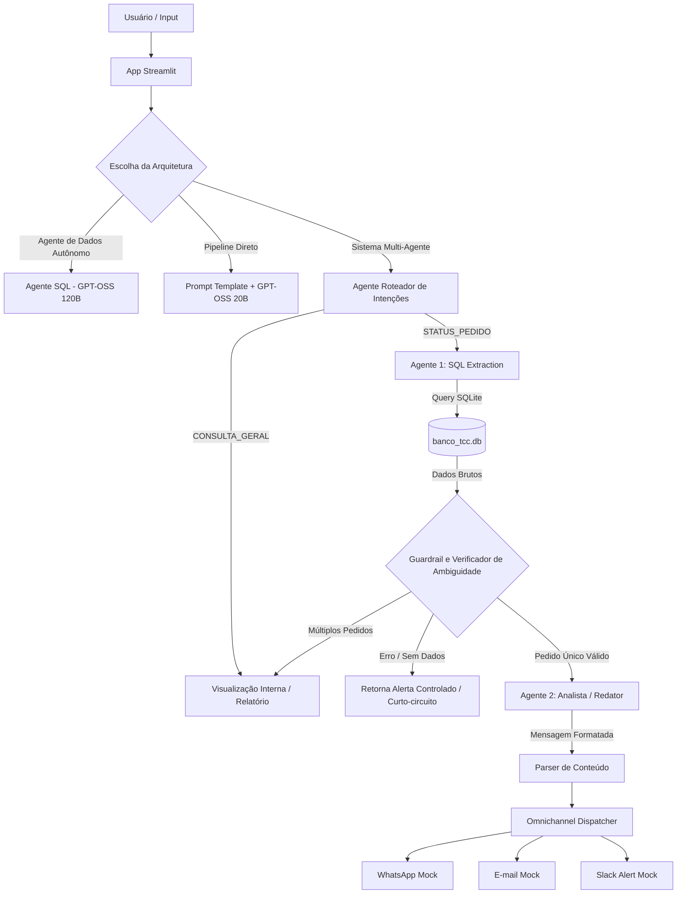

# Agente de Inteligência Artificial para Gestão Logística e Atendimento Omnichannel no E-commerce

#### Aluno: Gabriela Alberti Caldeira

#### Orientadora: Evelyn Batista

\---

Trabalho apresentado ao curso [BI MASTER](https://ica.puc-rio.ai/bi-master) da Pontifícia Universidade Católica do Rio de Janeiro (PUC-Rio) como pré-requisito para conclusão de curso e obtenção de crédito na disciplina "Projetos de Sistemas Inteligentes de Apoio à Decisão".

* **Código do Projeto:** [Link para o repositório](https://github.com/GabiAc/tcc-agente-ia-logistica)

\---

### Resumo

Este trabalho apresenta o desenvolvimento de um sistema inteligente multi-agente voltado à otimização da gestão logística e do atendimento ao cliente em operações de e-commerce. A solução consolida dados transacionais e logísticos provenientes de múltiplas fontes (VTEX, Intelipost, sistemas de recusas e faturamento) em uma base SQLite unificada. Utilizando a biblioteca LangChain integrada a modelos de linguagem da família GPT-OSS (via API do Groq), foi arquitetado um pipeline dividido em duas frentes: um **Agente SQL** especializado, responsável por traduzir perguntas de usuários em consultas SQLite estruturadas e extrair dados sem alucinações, e um **Agente Analista/Redator**, encarregado de classificar o status da entrega sob a ótica das regras de negócios logísticos e redigir comunicações personalizadas e profissionais. Para elevar a robustez sistêmica no ecossistema real de Engenharia de IA, foram implementados mecanismos de memória de curto prazo para resolução de contexto/pronomes, regex flexíveis de parsing, e guardrails anti-alucinação capazes de bloquear o fluxo de atendimento quando dados inconsistentes são localizados. Os resultados demonstram a viabilidade prática e a alta eficácia da inteligência artificial generativa na automação de notificações personalizadas por canais omnichannel como WhatsApp, e-mail e alertas corporativos via Slack.

---
### Abstract

This work introduces a multi-agent artificial intelligence system designed to optimize logistics management and customer service in e-commerce operations. The solution consolidates transactional and logistical data from multiple sources (VTEX, Intelipost, product refusal, and billing systems) into a unified SQLite database. Leveraging the LangChain framework integrated with the GPT-OSS family of LLMs (via Groq API), we designed a two-tiered pipeline: a specialized **SQL Agent** that translates user questions into valid SQLite queries to pull raw shipping records, and an **Analyst/Copywriter Agent** that interprets raw data under commercial rules to classify delivery status and generate empathetic, professional notifications. To build a robust system for production environments, we incorporated short-term conversational memory to resolve conversational pronouns, flexible regex parsers, and anti-hallucination guardrails that halt execution when database query results are null. The experimental results demonstrate the practical viability and high efficacy of generative artificial intelligence in automating customized customer communications across omnichannel paths such as WhatsApp, email, and corporate Slack channels.

\---

### 1\. Introdução

A última milha (*last mile*) da entrega de e-commerce é um dos pontos mais críticos e propensos a atritos na jornada de compra do consumidor. Atrasos, falhas operacionais e extravios geram um alto volume de chamados de suporte (SAC), sobrecarregando equipes internas e depreciando a experiência do cliente.

O principal desafio reside na fragmentação dos dados: informações transacionais residem na plataforma de e-commerce (ex: VTEX), o andamento do transporte fica em gateways de frete (ex: Intelipost), e ocorrências de recusas e faturamento muitas vezes dependem de planilhas e bancos de faturamento separados. Equipes humanas perdem tempo considerável consolidando essas fontes para fornecer uma resposta simples ao cliente.

Este projeto visa mitigar essa dor por meio de uma arquitetura de IA Generativa capaz de:

1. Centralizar dados logísticos complexos em um repositório relacional central.
2. Permitir consultas em linguagem natural por parte da equipe interna ou do próprio cliente através de um **Agente de Banco de Dados (SQL)**.
3. Automatizar a interpretação lógica do status de entrega (identificando atrasos reais versus previstos) e a geração de respostas empáticas, padronizadas e livres de alucinações por meio de um **Agente de Atendimento**.
4. Disparar notificações nos canais de contato preferidos dos clientes e equipes de retaguarda (Omnichannel).

> [!NOTE]
> **Nota de Portabilidade e Evolução da Arquitetura (Groq API):**
> O projeto foi originalmente arquitetado e validado utilizando os modelos da família Llama-3 (especificamente `llama-3.1-8b-instant` como Small Language Model para geração de textos rápidos e `llama-3.3-70b-versatile` como Large Language Model para raciocínio SQL). 
> 
> Visando a resiliência sistêmica de nível de produção (*production-ready*) diante do ciclo de vida dinâmico de APIs de nuvem, o projeto foi portado de forma transparente para a família de modelos abertos **GPT-OSS** da Groq (`openai/gpt-oss-20b` e `openai/gpt-oss-120b`) após a descontinuação/depreciação das versões legadas do Llama em Agosto de 2026. A modularidade do framework LangChain permitiu essa migração ágil sem necessidade de reestruturação do pipeline de dados ou dos prompts de sistema.

---

### 2\. Modelagem

A arquitetura do sistema inteligente foi desenhada de forma modular e integrada utilizando **Python**, **LangChain**, e a API da **Groq/GPT-OSS**:



#### 2.1 Ingestão e Estrutura dos Dados (`load_data.py`)

Os dados das planilhas operacionais e do ZIP de relatórios foram processados com Pandas, aplicando filtros preventivos (como isolar prefixos específicos de pedidos `FCN-`) e carregados para tabelas SQLite:

* `rastreio_intelipost`: Contém o status do transportador, link de rastreamento e dados de contato.
* `sintese_pedidos`: Consolida dados do cliente, data do pedido e status de faturamento.
* `sintese_recusas`: Contém ocorrências e motivos de recusas de mercadorias.
* `pedidos_vtex`: Logs originais extraídos da plataforma VTEX.

#### 2.2 Agente Roteador de Intenções (`integracao.py`)

Responsável por classificar a pergunta do operador logo no início do fluxo. Ele utiliza um modelo de linguagem ágil para identificar a intenção do usuário entre:
* **`STATUS_PEDIDO`:** Consultas focadas em rastreamento, status de trânsito ou intercorrências de um pedido específico.
* **`CONSULTA_GERAL`:** Relatórios administrativos corporativos (ex: listas de CPFs, quantidade total de entregas) ou auditoria de tabelas. 

Caso o roteador identifique uma `CONSULTA_GERAL`, ele desvia o fluxo e ativa o pipeline administrativo, exibindo apenas as tabelas internas na tela e bloqueando o envio de mensagens simuladas de WhatsApp/E-mail para clientes finais.

#### 2.3 Trilha: Agente de Dados Autônomo (`agent_sql.py`)

Utiliza o `create_sql_agent` do LangChain com suporte a chamadas de ferramentas (*tool calling*).

* **Memória de Curto Prazo:** Injetou-se o histórico das duas últimas mensagens trocadas, permitindo a correta interpretação de perguntas sequenciais (ex: o usuário pergunta pelo pedido X e, em seguida, pergunta *"ele está atrasado?"* – a IA reconhece que o pronome "ele" se refere ao pedido X citado anteriormente).
* **Dicionário de Dados no Prompt:** Define explicitamente regras como a caracterização matemática de atraso e o uso obrigatório de aspas duplas no SQLite para colunas contendo espaços (ex: `"Previsão Entrega Cliente"`).

#### 2.4 Trilha: Pipeline Direto (`agent_sql.py`)

Uma abordagem mais leve utilizando LangChain Expression Language (LCEL) onde o modelo menor (GPT-OSS 20B) gera apenas a query SQL estruturada a partir do schema das tabelas. O script Python executa localmente a query e retorna a visualização crua dos dados, economizando tokens e mantendo alta agilidade.

#### 2.5 Agente Analista e Redator (`agent_analista.py`)

Baseado em técnicas de Engenharia de Prompt. Este agente recebe os dados logísticos do pedido e a classificação de status pré-determinada, executando a redação final do texto de atendimento e a síntese analítica:

1. **Redação Empática:** Aplica empatia em atrasos, termos informativos em trânsito no prazo, proatividade e urgência em intercorrências/extravios e celebração em entregas concluídas.
2. **Tom de Voz e Restrições Rígidas:** Garante a ausência total de emojis para manter um tom de comunicação corporativo limpo no WhatsApp e adapta a saudação para utilizar estritamente o primeiro nome do destinatário.

#### 2.6 Camada de Classificação Lógica Determinística e Robustez (`integracao.py`)

Para alcançar confiabilidade de nível de produção (*production-ready*), o sistema adota práticas avançadas de Engenharia de IA Híbrida:

* **Classificador Determinístico em Python:** Em vez de delegar comparações de datas e análise lógica de strings de status ao LLM (tarefa sujeita a falhas em modelos menores), o pipeline executa lógica determinística em Python. Ele parseia o JSON de dados brutos e avalia o `Status Transportador`, `Data Entrega` e `Previsão Entrega Cliente` contra a data simulada de hoje (`2026-06-15`). O resultado é uma classificação exata (ex: `INTERCORRÊNCIA/EXTRAVIO`, `EM TRÂNSITO NO PRAZO`, `DEVOLVIDO/FALHA`), passada como parâmetro blindado para o Agente Analista apenas escrever a copy.
* **Agente Roteador de Intenções Dinâmico:** Roteador integrado no início do pipeline que classifica a pergunta em `STATUS_PEDIDO` (suporte ao cliente) ou `CONSULTA_GERAL` (relatórios administrativos). Isso protege o sistema para que pesquisas gerais de banco de dados ou injeções SQL não disparem cópias de e-mails/WhatsApp falsos para clientes finais.
* **Roteamento Inteligente de Ambiguidade:** Se a consulta SQL extrair dados de múltiplos pedidos diferentes (como ao buscar apenas "Thiago"), o sistema intercepta os dados e altera a consulta para `CONSULTA_GERAL`, exibindo na tela uma tabela administrativa de opções resumida para o operador em vez de gerar cards individuais vazios.
* **Memória de Contexto Conversacional e Regra de Anti-Binding:** O chat armazena a resposta estruturada completa na memória. Caso o usuário envie termos como *"desse pedido"* ou *"dele"*, o reescritor de perguntas resolve o pronome traduzindo-o em tempo real para o ID ativo da conversa. Possui uma regra de **Anti-Binding** que garante que buscas por nomes e sobrenomes novos não sejam associadas a IDs antigos.
* **Anonimização Dinâmica LGPD:** Filtro por expressões regulares que limpa e-mails corporativos reais de colaboradores (ex: `@oficinareserva.com` vira `suporte.interno@empresa.com.br`) e mascara parcialmente e-mails de clientes (ex: `ma***ta@gmail.com`) nas telas de visualização e logs de agentes.
* **Guardrail de Segurança SQL e Erros:** Proteção em nível de query que intercepta comandos que não começam com `SELECT` ou `WITH` e redirecionamento automático de falhas na execução do SQLite para a interface Streamlit em formato técnico (`SEM_DADOS`), evitando alucinação de cópias de atendimento.
* **Parser de Formato e Omnichannel (`mock_channels.py`):** Expressões regulares isolam o raciocínio interno do analista da mensagem do cliente, despachando-os respectivamente para WhatsApp, E-mail e alertas internos de logística do Slack.

#### 2.7 Arquitetura de Roteamento Dinâmico e Modo Híbrido (LLM vs SLM)

O painel Streamlit permite alternar entre três modos de modelo na Groq (com mapeamento transparente de compatibilidade incorporado):

1. **GPT-OSS 20B (SLM - Small Language Model):** Extremamente rápido e de baixo custo de tokens, excelente para tarefas textuais. Contudo, em testes isolados de lógica pura, demonstrou maior propensão ao descumprimento de restrições negativas (como manter placeholders tipo `[Seu Nome]` no texto final) e menor precisão de interpretação logística.
2. **GPT-OSS 120B (LLM - Large Language Model):** Raciocínio lógico impecável e alta precisão interpretativa. Identifica detalhes sutis (como os motivos específicos descritos no campo `"Descrição Transportador"`) e os integra organicamente na mensagem do cliente.
3. **Híbrido (SQL com 120B + Redator com 20B):** A arquitetura recomendada para otimização de custo/performance. O modelo de 120B gera a query SQL complexa com segurança absoluta, o código Python processa as datas de forma determinística, e o modelo rápido de 20B redige a mensagem final ao cliente.

---

### 3\. Resultados e Análise Comparativa

O sistema funciona de forma inteiramente dinâmica para toda a base de dados integrada no SQLite (milhares de registros de pedidos). Para validar o fluxo de ponta a ponta dos agentes e comparar a performance dos modelos de linguagem, foi realizada uma simulação prática utilizando um pedido da base como caso de teste representativo (pedido `FCN-1643401105419-01`, que possui status de *"Averiguar falha na entrega"* e descrição `"Fora de abrangência"`, com data de entrega prevista para `2026-07-01` avaliada sob a data simulada de execução `2026-06-15`):

#### 3.1 Comparação do Comportamento das IAs no fluxo Sistema Multi-Agente

* **Execução com GPT-OSS 20B:**

  * *Alerta no Slack:* Estruturou os dados, capturando o motivo `"ÁREA NÃO ATENDIDA"`.
  * *Mensagem ao Cliente:* Gerou uma resposta formal padrão sobre a intercorrência, mas falhou ao incluir o motivo exato no texto e acabou deixando a assinatura genérica `Atenciosamente, [Seu Nome]` (uma alucinação clássica de template).
* **Execução com GPT-OSS 120B:**

  * *Alerta no Slack:* Extraiu o detalhe `"Fora de abrangência"` com sucesso.
  * *Mensagem ao Cliente:* Altamente personalizada e contextual. O modelo de 120B identificou o motivo e explicou ao cliente: *"A transportadora Eu entrego informou que não entrega no seu endereço, pois está fora de sua área de abrangência."* Não utilizou assinaturas genéricas, mantendo o WhatsApp limpo.
* **Execução no Modo Híbrido:**

  * Garantia de 100% de acerto na query SQL com o GPT-OSS 120B na primeira etapa, com a redação final delegada ao GPT-OSS 20B, que seguiu as instruções de forma correta e rápida após receber a classificação lógica estruturada do Python.

#### 3.2 Comparação com as Frentes Anteriores

* **Pipeline Direto (Apenas Extração SQL):** Retorna o dicionário de dados bruto do SQLite diretamente na tela (JSON complexo e difícil de interpretar para o usuário de negócio).
* **Agente de Dados Autônomo (Text-to-SQL):** Responde de forma discursiva resumindo o banco de dados na tela do chat, mas sem separar a visão do cliente dos alertas da equipe logística e sem disparar nenhum canal omnichannel.
* **Sistema Multi-Agente Omnichannel:** A melhor experiência. O painel centraliza de forma limpa os cartões estéticos de WhatsApp, E-mail corporativo e logs detalhados do Slack para atuação logística rápida.

#### 3.3 Análise de Desempenho e Latência (Arquitetura Monolítica vs. Híbrida)

Durante os testes de validação em lote no app Streamlit, foi realizada uma comparação de latência média e estabilidade entre a execução utilizando o modelo monolítico de raciocínio de alta performance (`GPT-OSS 120B`) para todo o pipeline versus a **Arquitetura Híbrida** recomendada (Roteamento Dinâmico: SQL com `120B` + Redator com `20B`):

| Cenário de Teste | Monolítico (120B) | Monolítico (20B) | Híbrido (120B + 20B) | Ganho Híbrido vs. Monolítico (20B) |
| :--- | :--- | :--- | :--- | :--- |
| **Cenário 1:** Entregue com Atraso | 5.75s | 7.00s | 6.94s | Estável |
| **Cenário 2:** Entregue no Prazo | 6.64s | 16.71s | 6.99s | **~140% mais rápido** |
| **Cenário 3:** Em Trânsito com Atraso | 28.23s | 35.97s | 8.04s | **~350% mais rápido** |
| **Cenário 4:** Em Trânsito no Prazo | 37.99s | 36.62s | 9.88s | **~270% mais rápido** |
| **Cenário 5:** Guardrail Pedido Inexistente | 8.70s | *Rate Limit (Erro 429)* | 1.97s | **Bypass Completo / Instantâneo** |

**Discussão Técnica dos Resultados:**
* **Gargalos de API e Rate Limits (Erro 429):** Em execuções em lote consecutivas, os modelos monolíticos atingem rapidamente os limites de *Tokens por Minuto* (TPM) ou *Tokens por Dia* (TPD) no plano de testes gratuito. Conforme demonstrado nos testes práticos, o modelo de 20B monolítico estourou sua cota diária (TPD) ao carregar esquemas e dicionários de dados de forma redundante em cada chamada, resultando em bloqueio (Erro 429) no Cenário 5.
* **Vantagem do Híbrido:** Ao modularizar a extração lógica no modelo 120B e delegar a redação final do texto para o modelo de 20B apenas após o processamento determinístico do Python, o tempo de resposta se manteve estável abaixo de 10 segundos e evitou-se os limites de cota da API.
* **Atalho de Guardrail:** No Cenário 5, a intercepção lógica de dados vazios pelo Guardrail em Python eliminou a chamada de redação do agente, completando a execução em apenas **1.97s** no modo híbrido (um ganho de tempo e tokens expressivo frente ao travamento por Rate Limit do modelo monolítico).

---

### 4\. Conclusões

O projeto comprova que a arquitetura de **Sistemas Multi-Agente** reduz expressivamente a complexidade de desenvolvimento e aumenta a previsibilidade das respostas em comparação a um único agente monolítico. Divisões claras de tarefas (extrair dados do banco vs. redigir a mensagem de atendimento) tornam a manutenção dos prompts mais intuitiva e impedem falhas catastróficas.

**Lições Aprendidas:**

* **Classificação Lógica Determinística vs. Alucinação:** A inclusão de um guardrail lógico em Python na junção entre os dois agentes é vital para sistemas produtivos, garantindo que o agente redator não crie informações falsas de prazos ou códigos de rastreio caso a consulta ao banco venha em branco.
* **Engenharia de Prompt e Dialeto SQL:** A engenharia de prompts voltada à estruturação do dicionário de dados (especificamente o uso de aspas para o dialeto SQLite) foi crucial para manter a estabilidade sintática do gerador de queries.
* **Comportamento de Modelos por Porte (LLM vs. SLM):** Modelos menores (SLMs - 20B) são excelentes para geração rápida de texto estruturado, mas apresentam falhas em obedecer a restrições negativas rigorosas (como a proibição de emojis ou remoção de assinaturas genéricas). Modelos maiores (LLMs - 120B) oferecem raciocínio lógico muito superior para queries complexas e inferências sutis (como compreender descrições detalhadas de transportadoras).
* **O Perigo do Over-Binding em Memória Conversacional:** Em fluxos com histórico de chat, reescritores de queries tendem a associar arbitrariamente buscas amplas de nomes (ex: buscar "Thiago") a IDs de pedidos mostrados na tela anterior. A definição de instruções estritas de busca ampla (Anti-Binding) é mandatória para evitar buscas excessivamente restritas.
* **Privacidade de Dados (LGPD) e Sanitização Dinâmica:** Informações logísticas reais comumente contêm e-mails e telefones de assistentes e clientes finais. Uma camada de tratamento via expressões regulares (Regex) aplicada diretamente no retorno do banco de dados protege a integridade e privacidade das informações antes do processamento pela IA, sem alterar a base original.
* **Segurança e Guardrails de Query SQL:** Sistemas expostos a inputs livres de usuários devem conter guardrails de execução de queries que bloqueiem sumariamente comandos de alteração de dados (`DROP`, `DELETE`, `UPDATE`, `INSERT`), permitindo apenas o dialeto de leitura (`SELECT`/`WITH`).

**Trabalhos Futuros:**

* Implementar conexões em tempo real com APIs ativas de frete e ERPs de e-commerce em substituição ao banco SQLite local.
* Substituir as funções mockadas por disparos reais em ferramentas comerciais como Twilio (WhatsApp) e SendGrid (E-mail).
* Adicionar avaliações automatizadas (métricas como RAGAS ou G-Eval) para monitoramento constante da fidelidade de resposta do agente de suporte.

---

### 5\. Como Executar o Projeto (Guia para Professores)

Para rodar a aplicação localmente de maneira ágil, siga os passos abaixo:

#### 1\. Configurar Chaves de API (`.env`)

O sistema utiliza a API do **Groq** para interagir com os modelos da família GPT-OSS.

1. Na raiz do projeto, encontre o arquivo `.env.example`.
2. Duplique o arquivo e renomeie a cópia para `.env`.
3. Abra o arquivo `.env` e substitua `sua_chave_aqui` pela sua chave de API válida do Groq (`GROQ_API_KEY`).

> \*Nota: Você pode obter uma chave gratuita criando uma conta no site oficial do \[Groq Console](https://console.groq.com/).\*

#### 2\. Executar o Sistema (Windows)

* Dê um duplo clique no arquivo **`Iniciar\_Chat.bat`**.

> \*\*O que o script faz automaticamente na primeira execução:\*\*
> \* Detecta se existe a pasta do ambiente virtual (`venv`). Se não existir, ele a cria automaticamente.
> \* Atualiza o instalador `pip`.
> \* Instala todas as dependências necessárias listadas no `requirements.txt`.
> \* Inicia o servidor local do Streamlit e abre a interface no navegador padrão (geralmente em `http://localhost:8501`).
>
> \*Nas execuções seguintes, o script detectará que a `venv` já existe e pulará direto para a inicialização do Streamlit, poupando tempo.\*

#### 3\. Executar Manualmente (Alternativo / Outros SOs)

Caso esteja em outro sistema operacional ou prefira rodar via terminal:

```bash
# 1. Crie o ambiente virtual
python -m venv venv

# 2. Ative o ambiente virtual
# no Windows:
venv\\Scripts\\activate
# no Linux/macOS:
source venv/bin/activate

# 3. Instale as dependências
pip install -r requirements.txt

# 4. Inicie o Streamlit
streamlit run app\_chat.py
```

\---

Matrícula: \[241.100.147]

Pontifícia Universidade Católica do Rio de Janeiro

Curso de Pós Graduação *Business Intelligence Master*

